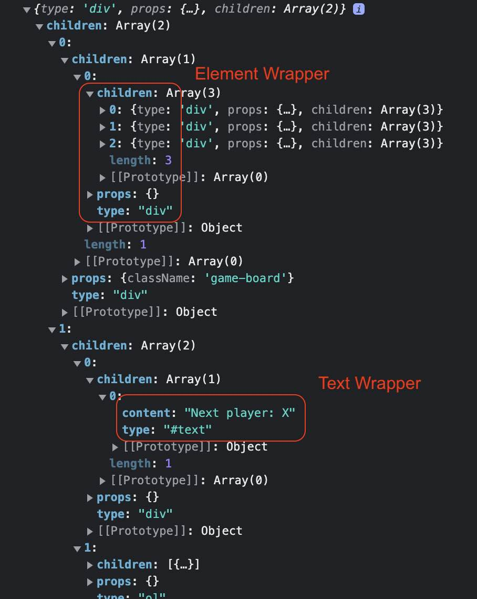
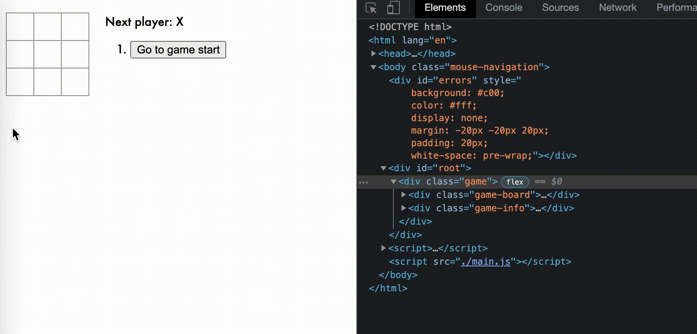
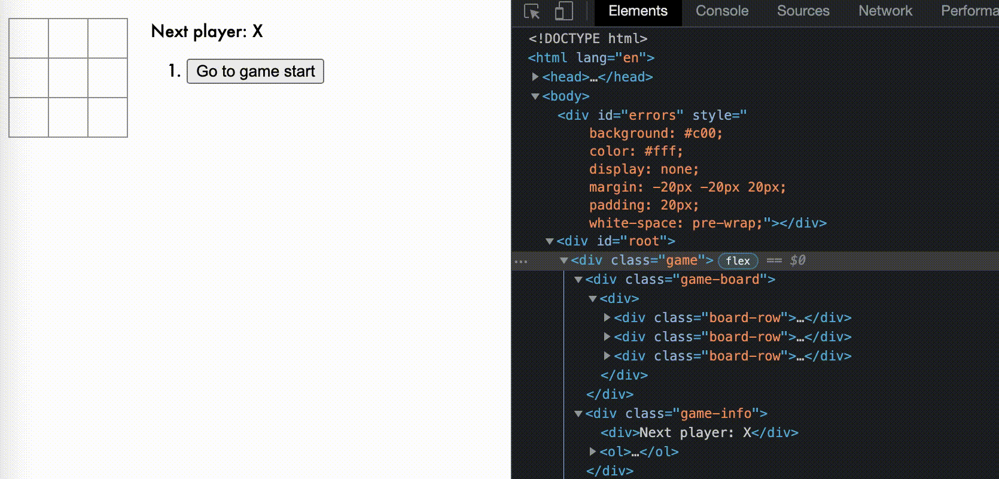

# react toy implementation

## install npm packages

- to support webpack

   ```shell
   npm install webpack webpack-cli --save-dev
   ```

- to support babel loader

   ```shell
   npm install babel-loader @babel/core @babel/preset-env --save-dev
   ```

- to support react transform

   ```shell
   npm install @babel/plugin-transform-react-jsx --save-dev
   ```

## run project

- create & config webpack.config.js

- go to the project folder and run command below

   ```shell
   npx webpack
   ```

- go to the folder dist under the project, then open the HTML file

## table of content

- toy01
   - render simple predefined elements by document.createElement & document.appendChild
   - define customer own components
   - render child elements and chid text nodes
   - render state

- toy02
   - support render: uses document.Range
   - support re-render
   - support event listener
   - support combined setState: update state & invoke re-render

- toy03
   - react tutorial - [Tic Tac Toe](https://reactjs.org/tutorial/tutorial.html)

- toy04
   - print virtual DOM
   - 

- toy05
   - render virtual DOM to DOM
   - replace rerender by virtual DOM: use simple diff algorithm
   - full refresh - toy03 
      
   - partial update with virtual DOM
      

## screencast to gif

- brew install ffmpeg & gifsicle
- run command

```bash
# simple
ffmpeg -i in.mov -r 10 -f gif - | gifsicle --optimize=3 > out.gif
# capture the first 6 seconds only, the option -ss <second> start from <second>
ffmpeg -i in.mov -t 6 -r 10 -f gif - | gifsicle --optimize=3 > out.gif
# with additional options screen size, color format and delay
ffmpeg -i in.mov -s 600x400 -pix_fmt rgb24 -r 10 -f gif - | gifsicle --optimize=3 --delay=3 > out.gif
```
